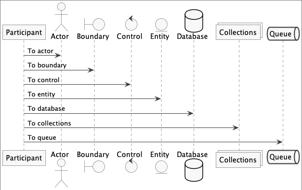
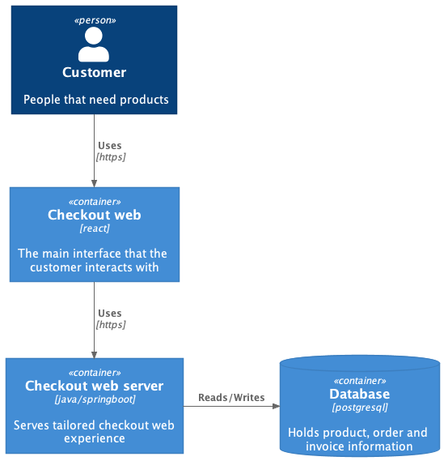

# Documents in (code) repository

Keep your code and a lightweight description of what it does together.

## Example

### Simple diagram

The source is [here](./diagrams/template.pu).

### C4 template

The source is [here](./diagrams/template-c4.pu).

